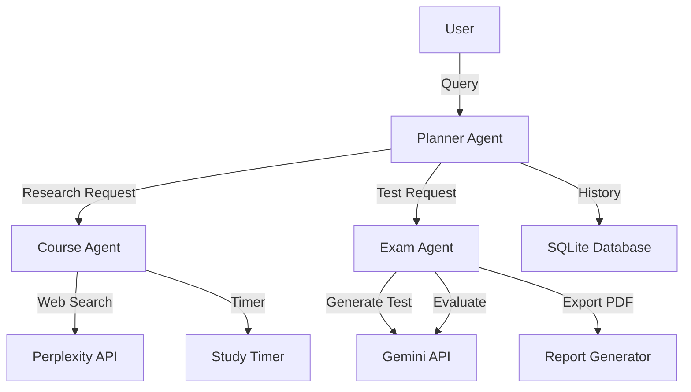

<div align="center">

# Shisui

### Your Intelligent Learning Companion

*Powered by Multi-Agent AI Architecture*

[](https://fastapi.tiangolo.com/)
[](https://nextjs.org/)
[](https://cloud.google.com/)
[](https://www.typescriptlang.org/)
[](https://www.python.org/)

</div>

---

## What is Shisui?

**Shisui** is an advanced AI-powered learning assistant that helps students master any subject through intelligent research, guided study sessions, and adaptive testing. Built on a sophisticated multi-agent architecture, Shisui orchestrates specialized AI agents to provide a comprehensive learning experience.

### Key Features

<table>
<tr>
<td width="50%">

#### **Smart Research**
- Web-powered topic exploration
- Curated learning materials
- Citation-backed answers
- Real-time information retrieval

</td>
<td width="50%">

#### **Study Planning**
- AI-generated study schedules
- Time-blocked learning sessions
- Task breakdown & prioritization
- Adaptive pacing

</td>
</tr>
<tr>
<td width="50%">

#### **Study Timer**
- Focused study sessions
- Pomodoro-style breaks
- Progress tracking
- Distraction-free learning

</td>
<td width="50%">

#### **Adaptive Testing**
- AI-generated quizzes
- Instant feedback
- PDF exam exports
- Performance analytics

</td>
</tr>
<tr>
<td width="50%">

#### **Learning History**
- Session tracking
- Progress monitoring
- Study pattern analysis
- Personalized recommendations

</td>
<td width="50%">
</td>
</tr>
</table>

---

## Architecture

Shisui uses **Agent-to-Agent (A2A)** communication powered by Google's ADK framework:



### Specialized Agents

| Agent | Role | Tools |
|-------|------|-------|
| **Planner Agent** | Main coordinator & intelligent router | General Search, History Retrieval, Agent Delegation |
| **Course Agent** | Research & study management | Perplexity Search, Study Timer, Schedule Generator |
| **Exam Agent** | Test generation & evaluation | Gemini API, PDF Generator, Answer Evaluator |

---

## Getting Started

### Prerequisites

- **Python 3.11+**
- **Node.js 18+**
- **pnpm** (or npm)
- API Keys:
  - Google API Key (for Gemini)
  - Perplexity API Key (for web search)

### Backend Setup

```bash
cd Shisui-backend

# Create virtual environment
python -m venv venv
source venv/bin/activate  # On Windows: venv\Scripts\activate

# Install dependencies
pip install -r requirements.txt

# Configure environment
cp .env.example .env
# Edit .env and add your API keys

# Run the server
python main.py
```

The backend will start on `http://localhost:8000`

### Frontend Setup

```bash
cd shisui

# Install dependencies
pnpm install

# Configure environment
cp .env.local.example .env.local
# Edit .env.local if needed (default: http://localhost:8000)

# Run the development server
pnpm dev
```

The frontend will start on `http://localhost:3000`

---

## Tech Stack

### Backend
- **FastAPI** - High-performance async API framework
- **Google ADK** - Multi-agent orchestration
- **Gemini API** - AI-powered test generation
- **Perplexity API** - Real-time web search
- **SQLite** - Local session & history storage
- **ReportLab** - PDF generation

### Frontend
- **Next.js 16** - React framework with App Router
- **TypeScript** - Type-safe development
- **Tailwind CSS v4** - Modern styling
- **React Markdown** - Rich text rendering
- **Lucide Icons** - Beautiful iconography
- **Server-Sent Events** - Real-time streaming

---

## Project Structure

```
shisui/
├── Shisui-backend/          # FastAPI backend
│   ├── agents/              # AI agent definitions
│   │   ├── planner_agent.py
│   │   ├── course_agent.py
│   │   └── exam_agent.py
│   ├── tools/               # Agent tools
│   │   ├── search_tool.py
│   │   ├── timer_tool.py
│   │   ├── exam_tool.py
│   │   └── database_tool.py
│   ├── reports/             # Generated PDF exams
│   ├── main.py              # FastAPI app entry
│   └── requirements.txt
│
├── shisui/                  # Next.js frontend
│   ├── app/
│   │   ├── components/      # React components
│   │   ├── page.tsx         # Main chat interface
│   │   └── layout.tsx
│   ├── public/              # Static assets
│   └── package.json
│
└── specs/                   # Design specifications
```

---

## Features in Detail

### Intelligent Chat Interface

- **Streaming responses** for real-time feedback
- **Agent transparency** - see which specialist is working
- **Tool indicators** - visual feedback for searches, timers, and tests
- **Citation support** - all research is source-backed
- **Markdown rendering** - rich formatted responses

### Study Session Management

- Set custom study timers
- Track learning sessions
- Review past interactions
- Monitor progress over time

### Adaptive Testing

- Generate custom quizzes on any topic
- Multiple-choice format with explanations
- Instant grading and feedback
- Export tests as professional PDFs
- Performance tracking

---

## Environment Variables

### Backend (`.env`)

```env
PERPLEXITY_API_KEY=your_perplexity_api_key
GOOGLE_API_KEY=your_google_api_key
API_BASE_URL=http://localhost:8000
```

### Frontend (`.env.local`)

```env
NEXT_PUBLIC_API_URL=http://localhost:8000
```

---

## API Endpoints

| Method | Endpoint | Description |
|--------|----------|-------------|
| `GET` | `/` | Health check |
| `POST` | `/chat` | Stream chat responses (SSE) |
| `GET` | `/reports/{filename}` | Download generated PDF |

---

## Contributing

Contributions are welcome! Please feel free to submit a Pull Request.

---

## License

This project is licensed under the MIT License.

---

<div align="center">

### Built with Google ADK

**Shisui** - Making learning intelligent, one conversation at a time.

</div>
